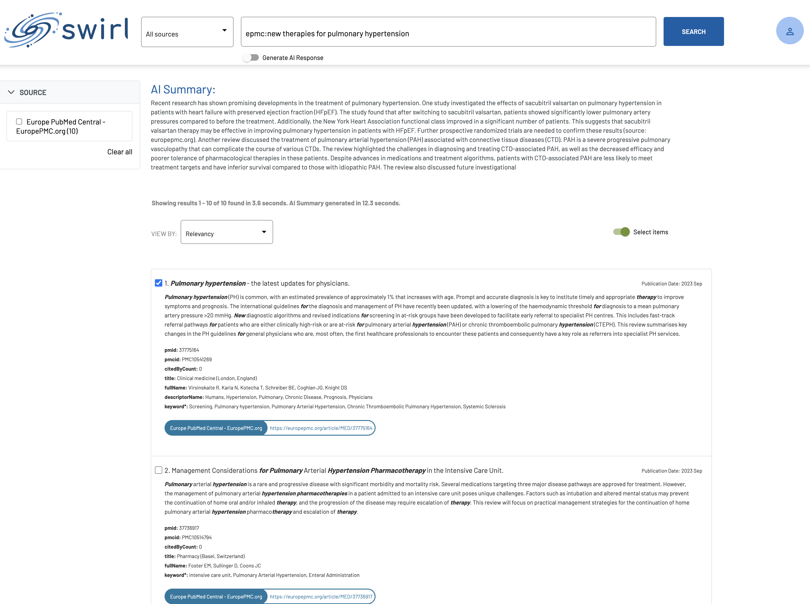

<details markdown="block">
  <summary>
    Table of Contents
  </summary>
  {: .text-delta }
- TOC
{:toc}
</details>

# AI Retrieval Augmented Generation (RAG) Guide

Swirl supports Real Time [Retrieval Augmented Generation (RAG)](index.md#what-is-retrieval-augmented-generation-rag-does-swirl-support-it) out of the box, using existing search engines, databases and enterprise services. 

## Intended Audience

This guide details how to configure and tune Swirl (v. 3.0 or newer) to perform RAG. It is intended for use by developers and/or system administrators with the ability to configure the system to connect to services like OpenAI's ChatGPT.

# Setting up RAG

1. Install Swirl 3.0 as noted in the [Quick Start Guide](Quick-Start.md), including the latest version of the Galaxy UI.

2. Add an OpenAI API key to the `.env` file:
```
OPENAI_API_KEY=your-key-here
```

3. When installing for PRODUCTION use, change the following line in `static/api/config/default` from:
```
"webSocketConfig": {
    "url": "ws://localhost:8000/chatgpt-data"
  }
``` 
...to...
```
"webSocketConfig": {
    "url": "wss://localhost:8000/chatgpt-data"
  }
```
*This default `ws:` can be used locally but should NEVER be done in production since it is not secure!*

4. Add the following configuration to the `page_fetch_config_json parameter` of each SearchProvider you wish to have participate in RAG:
```
"page_fetch_config_json": {
        "cache": "false",
        "headers": {
            "User-Agent": "Swirlbot/1.0 (+http://swirl.today)"
        },
        "timeout": 10
}, 
```
Adjust the `timeout` value if necessary. Change the `User-Agent` string as needed, and/or authorize it to fetch pages from internal applications. Note that this configuration item has already been added to the [European PMC](https://github.com/swirlai/swirl-search/blob/main/SearchProviders/europe_pmc.json) SearchProvider.

5. Restart Swirl: 
```
python swirl.py restart
```

6. Go to the Galaxy UI ([http://localhost:8000/galaxy/](http://localhost:8000/galaxy/)). The "Generate AI Response" switch should be "off" as shown:


7. Run a search. Results appear quickly after you press the "Search" button ([http://localhost:8000/galaxy/?q=epmc:future+of+ai+care](http://localhost:8000/galaxy/?q=epmc:future+of+ai+care)):


8. If you wish to manually select the results to RAG with, click the "Select Items" switch to make the shopping cart appear. Results that Swirl thinks should be used in RAG will be pre-checked. Check or uncheck results, and optionally sort and/or filter them.


9. Click the "Generate AI Response" switch. A spinner will appear. The RAG response will appear in 5-15 seconds :slightly_smiling_face: depending on a variety of factors.


10. Verify the RAG insight you received by reviewing the citations - result numbers, in brackets, at the end of the relevant passage.  

## Notes

* Swirl does not recommend RAG with public web data due to difficulties extracting article content; for those seeking a solution for public data please [contact Swirl](mailto:hello@swirl.today).

* The community edition of Swirl is intended to RAG with sources you can fetch without authenticating. If you need to perform RAG with content from enterprise services like Microsoft 365, ServiceNow, Salesforce, Atlassian with OAUTH2 and SSO, please [contact us for information about Swirl Enterprise](mailto:hello@swirl.today) - which supports all of that, and more, out of the box.
